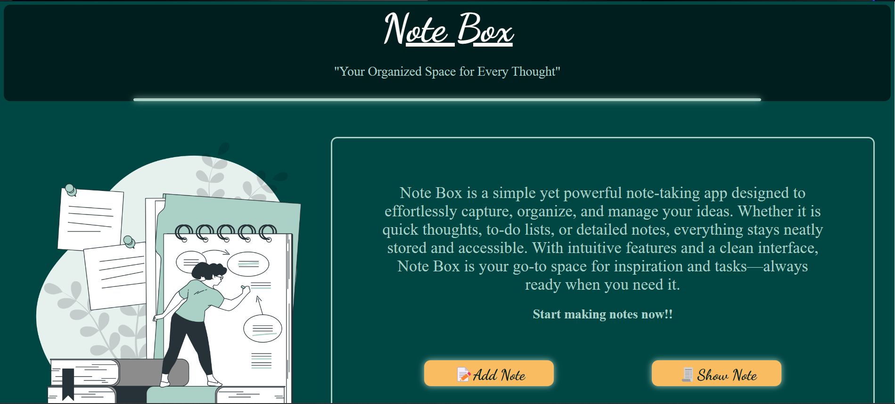
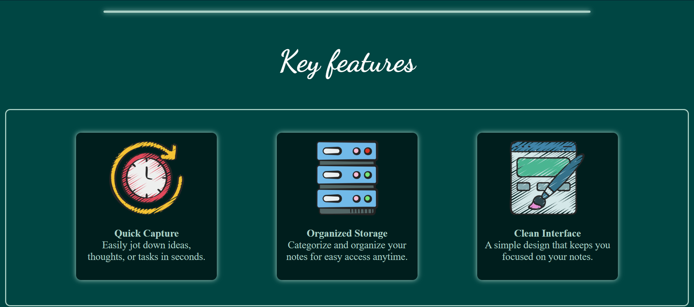
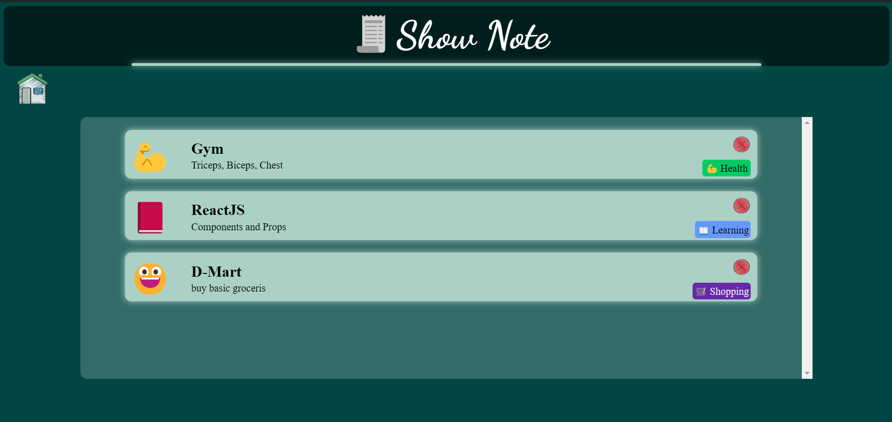

# Note Box

**Note Box** is a simple and user-friendly note-taking application that allows you to easily capture, organize, and manage your notes. With a clean interface and intuitive features, Note Box helps you keep track of your thoughts, tasks, and ideas effortlessly.



*Home Screen*

## Features

- **Quick Note Creation**: Easily add new notes with titles, descriptions, categories, and emojis.
- **Organized Storage**: Categorize your notes for easy access and better organization.
- **Clean Interface**: A simple and intuitive design that keeps you focused on your notes.
- **Emoji Support**: Add emojis to your notes for a more personalized touch.
- **Responsive Design**: Works seamlessly on both desktop and mobile devices.

## Screenshots:
1. **Home Screen:**

2. **Add note Screen:**

3. **Show note Screen:**


## Clone the repository:

   ```bash
   git clone https://github.com/prathamagre/NoteBox.git
